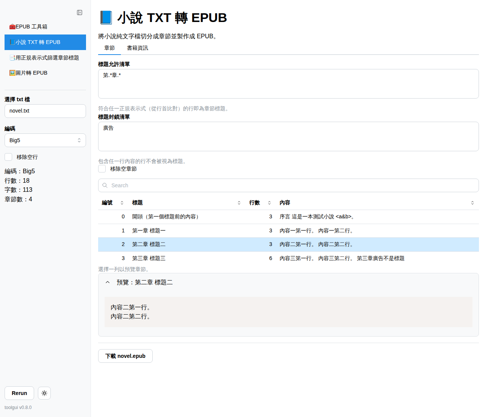

# 🧰 EPUB 工具箱



將純文字小說或圖片製作成 EPUB 電子書。以
[ToolGUI](https://github.com/voilelab/toolgui) 撰寫並編譯為 WebAssembly，
完全在瀏覽器中執行，檔案不會離開你的電腦。

介面語言依瀏覽器語言自動選擇：中文（`zh*`）或英文；可用首頁的連結或網址參數
`?lang=en`、`?lang=zh-TW` 切換。

**線上使用：<https://voilelab.github.io/epub_toolbox/>**

## 使用方式

### 📘 小說 TXT 轉 EPUB

將小說純文字檔切分成章節並製作成 EPUB。

1. 選擇小說的 TXT 檔。編碼（UTF-8、Big5、GB18030 等）會自動偵測，也可手動更改。
2. 用比對章節標題的正規表示式切分章節，並可用封鎖清單排除不該是標題的行。
3. 填寫書籍資訊。
4. 按下 `下載` 製作並儲存 EPUB。

### 🖼️ 圖片轉 EPUB（實驗性）

> 🧪 此功能仍在實驗階段，輸出結果可能不穩定。

將圖片打包成 EPUB，每頁一張圖。

1. 選擇圖片（PNG、JPEG、GIF 或 WebP）、其 zip 壓縮檔，或兩者混用。頁面依檔名的
   自然順序排列（`2.png` 在 `10.png` 之前）。
2. 填寫書籍資訊。
3. 按下 `下載` 製作並儲存 EPUB。

封面網址僅在該網站允許跨來源讀取時可用；否則請先下載圖片再上傳。

## 執行

需要 Go 1.27.1 以上（或設定 `GOTOOLCHAIN=auto`）。

```bash
# 瀏覽器（WebAssembly）
go tool toolgui-wasm serve ./cmd/epub_toolbox

# 靜態網站輸出至 dist/
go tool toolgui-wasm build -o dist ./cmd/epub_toolbox

# 本機伺服器 http://127.0.0.1:3000（英文介面加 -lang en）
go run ./cmd/epub_toolbox
```

推送到 `main` 會部署至 GitHub Pages（需在 repo 設定中將 Pages 來源設為 GitHub
Actions）。

## 專案結構

- `internal/epub`：EPUB 3 寫入器，僅使用標準函式庫
- `internal/novel`：編碼偵測、章節切分
- `internal/imgbook`：圖片與 zip 讀取、圖片書
- `internal/fetch`：封面下載
- `cmd/epub_toolbox`：ToolGUI 介面；`main_wasm.go` 供瀏覽器使用，
  `main_server.go` 用於原生執行檔
